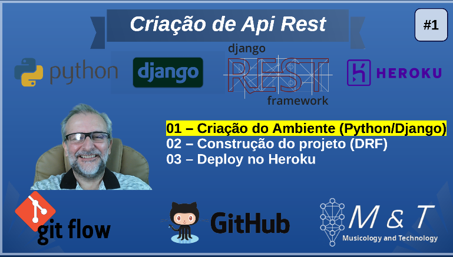

## Contruindo uma API com Django Rest Framework e realizando deploy da aplicação no heroku.

Os vídeos explicativos estão disponíveis em uma [playlist do YouTube](https://www.youtube.com/playlist?list=PLQvwSWYdLssxtAOs2L6RPD8QkcgGbABe-)

### Tecnologias utilizadas
* Python 3.8.6
* Django 3.1.3
* Djangorestframework 3.12.3
* Gitflow

#### Conteúdo Programático:
1. Configurando o ambiente de trabalho
2. Contruindo a estrutura do projeto e da base de dados
3. Utilizando o Django Rest Framework
4. Extruturando o projeto e realizando o deploy no Heroku

#### Observações Importantes
O descritivo com o "passo-a-passo" do projeto, bem como todos os comandos utilizados se encontra disponível no diretório pocket_book. O principal objeto da construção destes "livros de bolso" é oferecer um "guia rápido" para consultas futuras.

O projeto encontra-se disponível para utilização neste [link](https://djapidemo.herokuapp.com/)